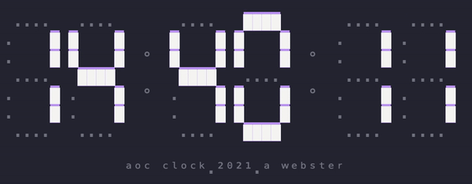

# Advent of Code Clock (aoc-clock)
[](https://svgshare.com/i/ZjP.svg) [](https://svgshare.com/i/Zhy.svg) 
 [](https://www.javascript.com)

A terminal clock based on Day 8's problem from 2021's Advent of Code.



# Introduction
The [Advent of Code problem](https://adventofcode.com/2021/day/8) that inspired this toy project was particulary nostalgia-inducing for me. Defining the rules for decoding the segment digits reminded me of codecracking books I read as a child.

I had a lot of fun [solving the problem](https://github.com/AlexanderWebster/advent-of-code-2021/tree/main/day-08-seven-segment-search), so I thought it would be even more fun to create a seven-segment display clock for the terminal.

I kept the format of the clock and its segments true to the original with one exception - you can optionally style the segments with the █ character. I felt that this gave the digits of the clock a neat retro-future, [Stanley Kubrick](https://en.wikipedia.org/wiki/Stanley_Kubrick_filmography)-esque look.

You can also enable periodic randomization of the ascii characters representing the segments, just like the Aoc problem.

# Table of Contents
* [Use aoc-clock](#use-aoc-clock)
    * [Install](#install)
    * [Examples](#examples)
    * [Usage](#usage)
* [Customization](#on-customization)    
* [Credits](#credit)

## Use aoc-clock
### Install
```bash
git clone https://github.com/AlexanderWebster/advent-of-code-clock.git
cd advent-of-code-clock
npm i
```
### Examples
```bash
# Default
node aoc-clock

# 12hr format, displays seconds
node aoc-clock -f 12 -p seconds

# 24hr format, displays seconds 
# Scrambles segment chars periodically
node aoc-clock -f 12 -p seconds -r

# Display seconds, scramble segment chars
# Specify segment colors and enable 'Kubrick' styling
node aoc-clock -p seconds -r -c white,magenta -k
```
### Usage
```
Usage: aoc-clock [options]

Options:
  -r, --rand              Randomizes the ascii chars assigned to each segment periodically (default: false)
  -f, --format <type>     Display 24 or 12 hour format (default: "24")
  -p, --precision <type>  Display seconds or minutes precision (default: "minutes")
  -c, --color <type>      Specify two Chalk.js colors for dots,digits (default: "grey,red")
  -k, --kubrick           Display clock in Kubrick style
  -h, --help              display help for command
  ```

## On Customization
All text coloring is done with the [Chalk](https://github.com/chalk/chalk) library. You can find all available colors there. Note: I would have preferred to use [Picocolors](https://github.com/alexeyraspopov/picocolors) for the speed/size benefits, but at the time of this writing, they do not appear to support retrieving and applying colors dynamically.

You can stack 'Kubrick'-mode and Chalk's backgound colors to achieve a neat visually styled clock.

## Credits
Special thanks to: 
- [Zhenhua Cao](https://medium.com/@benb88) - for his excellent [terminal-clock](https://github.com/bencao/terminal-clock) tutorial and libs.

- [Eric Wastl](http://was.tl/) , the creator of Advent of Code - for the yearly joy of problem solving and community.
